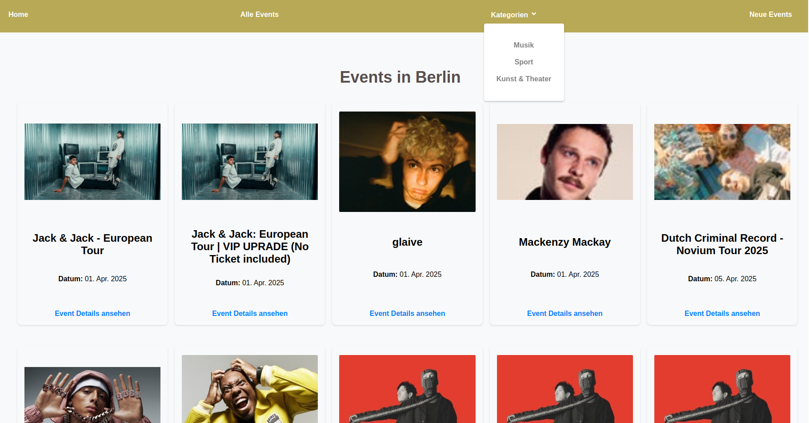

# Happening Berlin 🎉  

🚀 A modern event planning web app to help users organize and manage events effortlessly in **Berlin**.  

🔗 **Live Demo:** [EventPlaner](https://eventplaner.vercel.app/)  

## Features ✨  

- 📅 Create, edit, and manage events  
- 🎨 User-friendly and responsive design  
- 🔍 Search and filter events

  
## Screenshots 📸  





## Technologies Used 🛠️  

- **Frontend:** React, Next.js, TailwindCSS  
- **Backend:** (If applicable, mention backend technologies)  
- **Database:** (If applicable)  
- **Deployment:** Vercel  

## Installation & Setup 🏗️  

You can try the live version here: [EventPlaner](https://eventplaner.vercel.app/)  

To run this project locally, follow these steps:  

```bash
# Clone the repository
git clone https://github.com/your-username/eventplaner.git

# Navigate to the project folder
cd eventplaner

# Install dependencies
npm install

# Start the development server
npm run dev

